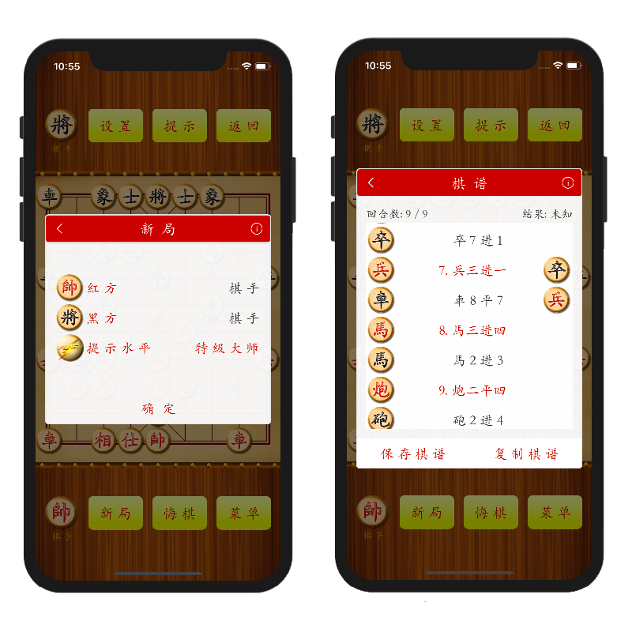
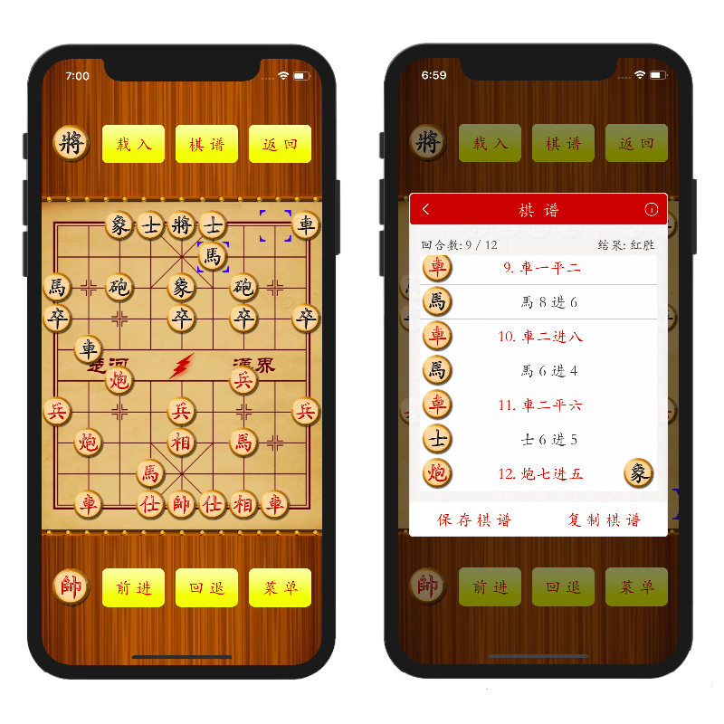

# ChineseChess（[中文点这里](/[Chinese]README.md)）
*Chinese Chess - A Free iOS App（C & Obj-C & Swift）*

## Overview Of This App（App 一览）
### Launch & Home Page（启动页 & 主页）

### Game Module（对弈模块）

### Edit Module（摆设棋局模块）

### History Module（棋谱模块）

### MultiPeer Module（联机模块）

***

## Versions Track
* 2017.10.11, right start the project.
* 2018.2.24, done with MultiPeer module, begin developing AI.

## Overview Of Functions
### Game Module
- support AI vs Human, you can select AI's level.（now __AI is developing__, using __PVS__）
- support immediate regret, new game or new settings.
- support reverse the board, opposite the chesses.
- support turn on/off the background music.

### Edit Module
- support clear and reset the board.
- support remove/put a chess on a legal grid.
- support load a history.

### History Module
- support history read, save, delete.
- support select a step and immediatly jump to the specific position.
- support jump to Game Module to play a game.

### MultiPeer Module
- support two people's game through the bluetooth or LAN.
- support regret, draw, give up.
- support start a new game.

## Overview Of AI（[Refer to scholar Morning Yellow's blog](http://www.xqbase.com/computer/eleeye_intro.htm)）
### Simple Chess Rule
- Long check or long catch will lead to lose.
- Both of side have no chess can attack will lead to draw.
- 50 rounds of moves have no eat will lead to draw.
- Same position appears many times will lead to draw.

### The Expression Of Chess and Board
- Board: an array, the length of it is 256.
- Chess: red is from 16 to 31, rank like King, Advisor, Advisor, Bishop, Bishop, Knight, Knight, Rook, Rook, Cannon, Cannon, Pawn, Pawn, Pawn, Pawn, Pawn, black is from 32 to 47, the same as red.

### Move Generate
- Short Type: King, Advisor, Bishop, Knight, Pawn, previous generate move array.
- Long Type: Rook, Cannon, bit row bit column.

### Position Evaluate
- Pre Evaluate: Analysis the status of position, judging whether the position is in the middle or the end,  the value of different status is different.
- Dynamic Evaluate: Called when search at the leaf node of PVS,  include two parts, one is location-chess value, another is dynamic evaluate, it includes the punishment of lack advisor or bishop, the control, hold, protection of knight, the hold, protection, threat, flexibility of rook and cannon, and the hollow cannon to the king (it means there's nothing between cannon and king).
